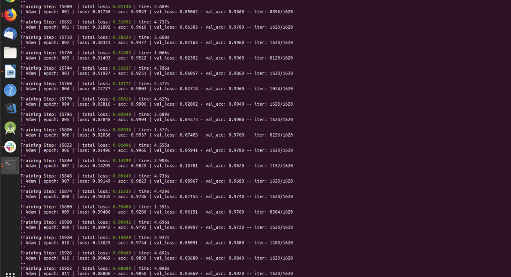

# Plant-Disease-Detection/Classification 

The manual detection of plant diseases is a  costly, and time-consuming process. The inaccuracies associated with identifying these diseases can lead to significant losses in both agricultural production and market value. Effective disease detection necessitates a substantial depth of knowledge and extensive research in the field of plant pathology.

To address these challenges, advanced techniques in image processing have been employed to detect plant diseases by analyzing the characteristics of leaves. Subsequently, 
# Convolutional Neural Network (CNN)  algorithm is employed to classify the disease and provide an accurate assessment of the results.

This integrated approach not only enhances the precision and efficiency of disease detection but also facilitates a more rapid response to potential outbreaks, ultimately benefiting the agricultural industry and the broader economy.

## For this:

Install the **requirement.txt** file from the repo **Plant-Disease-Detection.** Then the python script as  [cnn.py](https://github.com/shashangka-upadhyaya/Plant-Disease-Detection-Project/blob/master/cnn.py) gives the real insight of **CNN algorithm** for taining your dataset. I had **train** the dataset from **kaggle** i.e [Rice Diseases Image Dataset](https://www.kaggle.com/minhhuy2810/rice-diseases-image-dataset#LabelledRice.zip)

### Results
**1. The uptodate accuracy of this model with convulation neural network algorithm is given below :**

**2. The local server connection through ngrok.This ngrok helps to connect the ML module with android application. For more details, you can visit [here](https://dashboard.ngrok.com/get-started)**

 
